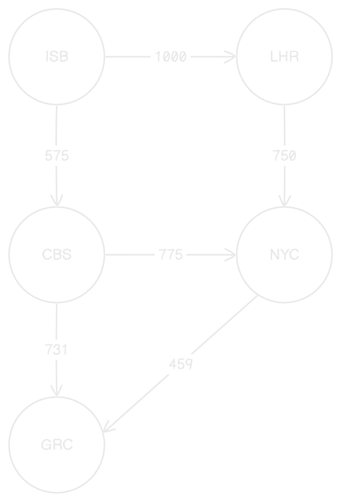

# Find shortest path between two airports

## Problem statement

You are given a list of airports and their connections. You need to find the shortest path between two airports. For more details, refer to the [task.md](./task.md).


## Implementation

The solution is implemented in Python and uses the `calculate_shortest_path` function in [main.py](./main.py) to find the shortest path between two airports.

The flow is as follows:

### 1. Convert airports data into a graph

The first step is to convert the list of airports and their connections into a graph. Each airport is represented as a node in the graph, and the connections between airports are represented as edges with a weight representing the cost of the connection.

This is the graphical representation of airports in [airports_data.json](./data/airports_data.json)



An adjacency list  is maintained for the graph. Graph is a python dictionary where keys are the nodes and values are lists of tuples representing the neighbors of each node and their costs.

Following is the adjacency list representation of above graph:
```
{
    'ISB': [('LHR', 1000), ('CBS', 575)],
    'LHR': [('NYC', 750)],
    'CBS': [('NYC', 775), ('GRC', 731)],
    'NYC': [('GRC', 459)],
}
```

### 2. Dijkstra's algorithm   

Dijkstra's algorithm is a graph search algorithm that finds the shortest path between two nodes in a graph. It works by maintaining a priority queue of nodes and their corresponding costs, and iteratively selecting the node with the lowest cost and updating the cost of its neighboring nodes.

Here, dijkstra is used to find the shortest path between two airports. It returns a list of airports representing the shortest path and its cost.

Dijkstra's algorithm is implemented in the `dijkstra` function in the [dijkstra.py](./dijkstra.py) file.


## Assumptions

1. The algorithm works only for the airports in `airports_data.json`. Otherwise, it will return `None` for the shortest path and `None` for the cost.
2. The algorithm only works for positive costs and does not handle negative costs.


## Code structure

```
.
├── data
│   ├── airports_data.json
├── dijkstra.py
├── graph.py
├── main.py
```

- `airports_data.json`: Contains the list of airports and their connections.
- `dijkstra.py`: Contains the implementation of Dijkstra's algorithm.
- `graph.py`: Contains the `Graph` class, which represents a graph data structure.
- `main.py`: Contains the `main` function, which prompts the user for the start and end airports and calls the `calculate_shortest_path` function to find the shortest path.

## Running the code

To run the code, follow these steps:

1. Clone the repository to your local machine.
2. Open a terminal or command prompt and navigate to the directory where the `main.py` file is located.
3. Run the following command to execute the code:

```bash
python main.py
```

This will prompt the user for the start and end airports and display the shortest path and its cost.

### Sample input/output
```
Enter the start airport: ISB
Enter the end airport: NYC

Shortest Path: ['ISB', 'CBS', 'NYC']
Cost: 1350
```

## Time & space complexity

Time complexity: O((V + E) logV)

Space complexity: O(V + E)

Where V is the number of vertices and E is the number of edges in the graph. 
